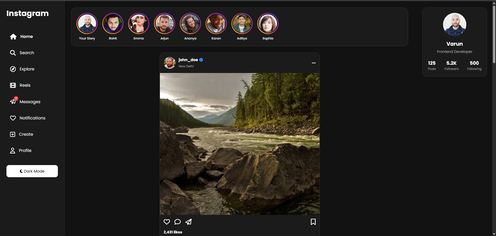
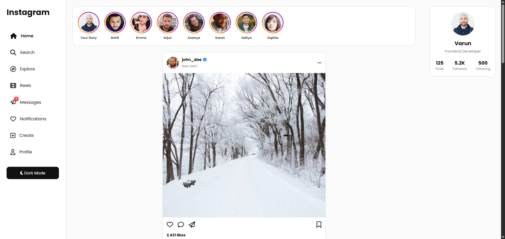
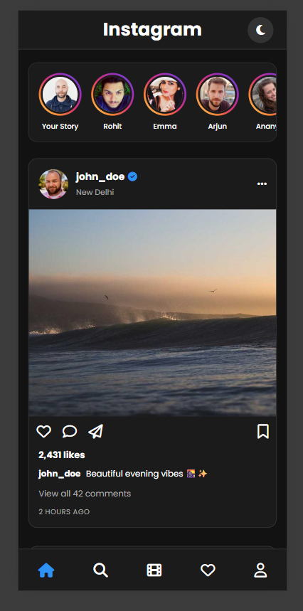

# Instagram UI Clone

A modern Instagram-inspired social media dashboard built using HTML, CSS, and JavaScript. This project focuses on creating a responsive and interactive frontend experience similar to Instagram while using only frontend technologies.

## Live Features

* Responsive Instagram-style layout
* Sidebar navigation menu
* Stories section with gradient story rings
* Feed posts with images and captions
* Like and Unlike functionality
* Dynamic like counter updates
* Double-click image to like
* Heart pop-up animation
* Notification side panel
* Profile popup modal
* Comment modal
* Create post modal
* Dark mode toggle with local storage support
* Infinite scrolling feed
* Mobile bottom navigation
* Responsive design for desktop, tablet, and mobile devices

## 📸 Screenshots

### Home Feed



### Light Mode



### Mobile View



## Technologies Used

* HTML5
* CSS3
* JavaScript (Vanilla JS)
* Font Awesome Icons

## Project Structure

```text
Instagram-Clone/
│
├── index.html
├── style.css
├── app.js
└── README.md
```

## How to Run

1. Download or clone the repository.
2. Open the project folder.
3. Open `index.html` in your browser.

## Learning Outcomes

This project helped in understanding:

* Responsive web design
* DOM manipulation
* Event handling
* Modal implementation
* Infinite scrolling
* Interactive UI animations
* Modern frontend layout structuring

## Author

Varun Singh Tanwar

BCA Student | Frontend Developer
